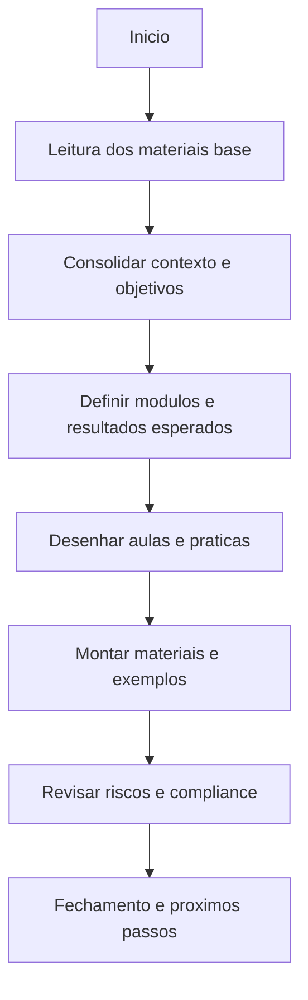

# Curso IA - Visao geral

```mermaid
flowchart TD
  A[Inicio] --> B[Leitura dos materiais base]
  B --> C[Consolidar contexto e objetivos]
  C --> D[Definir modulos e resultados esperados]
  D --> E[Desenhar aulas e praticas]
  E --> F[Montar materiais e exemplos]
  F --> G[Revisar riscos e compliance]
  G --> H[Fechamento e proximos passos]
```
