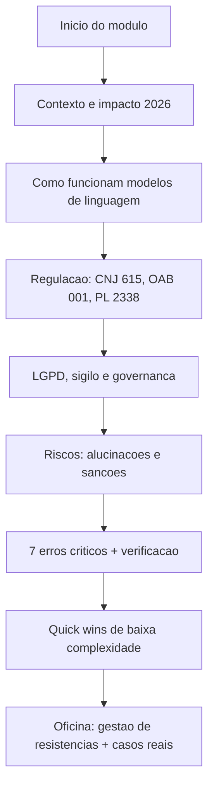

# Modulo 1 - Fundamentos, Regulacao e Seguranca

```mermaid
flowchart TD
  A[Inicio do modulo] --> B[Contexto e impacto 2026]
  B --> C[Como funcionam modelos de linguagem]
  C --> D[Regulacao: CNJ 615, OAB 001, PL 2338]
  D --> E[LGPD, sigilo e governanca]
  E --> F[Riscos: alucinacoes e sancoes]
  F --> G[7 erros criticos + verificacao]
  G --> H[Quick wins de baixa complexidade]
  H --> I[Oficina: gestao de resistencias + casos reais]
```
