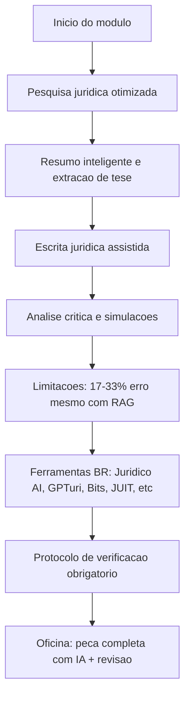

# Modulo 2 - Aplicacoes Juridicas Fundamentais

```mermaid
flowchart TD
  A[Inicio do modulo] --> B[Pesquisa juridica otimizada]
  B --> C[Resumo inteligente e extracao de tese]
  C --> D[Escrita juridica assistida]
  D --> E[Analise critica e simulacoes]
  E --> F[Limitacoes: 17-33% erro mesmo com RAG]
  F --> G[Ferramentas BR: Juridico AI, GPTuri, Bits, JUIT, etc]
  G --> H[Protocolo de verificacao obrigatorio]
  H --> I[Oficina: peca completa com IA + revisao]
```
