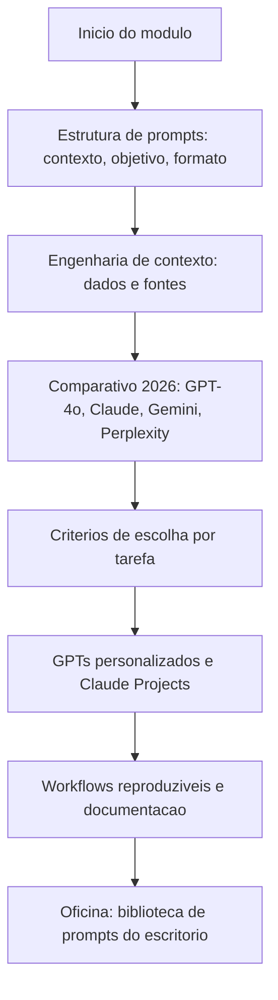

# Modulo 3 - Engenharia de Prompts e Contexto

```mermaid
flowchart TD
  A[Inicio do modulo] --> B[Estrutura de prompts: contexto, objetivo, formato]
  B --> C[Engenharia de contexto: dados e fontes]
  C --> D[Comparativo 2026: GPT-4o, Claude, Gemini, Perplexity]
  D --> E[Criterios de escolha por tarefa]
  E --> F[GPTs personalizados e Claude Projects]
  F --> G[Workflows reproduziveis e documentacao]
  G --> H[Oficina: biblioteca de prompts do escritorio]
```
