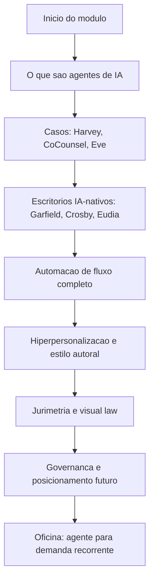

# Modulo 4 - IA Agentica e Aplicacoes Avancadas

```mermaid
flowchart TD
  A[Inicio do modulo] --> B[O que sao agentes de IA]
  B --> C[Casos: Harvey, CoCounsel, Eve]
  C --> D[Escritorios IA-nativos: Garfield, Crosby, Eudia]
  D --> E[Automacao de fluxo completo]
  E --> F[Hiperpersonalizacao e estilo autoral]
  F --> G[Jurimetria e visual law]
  G --> H[Governanca e posicionamento futuro]
  H --> I[Oficina: agente para demanda recorrente]
```
