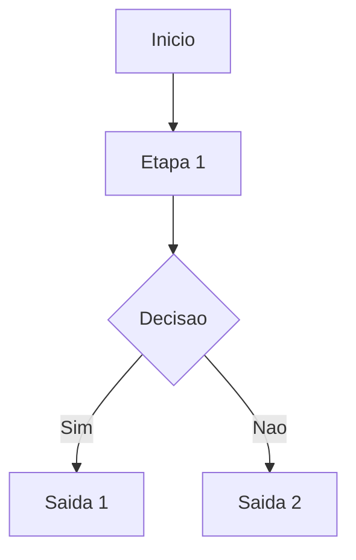

# Skill: diagramas mermaid + gps

Objetivo:
Criar diagramas Mermaid em Markdown e manter um indice GPS para navegacao rapida.

Quando usar:
- Ao pedir "diagramas", "mermaid", "gps" ou mapeamento do projeto.

Comandos:
- /diagramas: gerar diagramas Mermaid por tema em Markdown.
- /gps: atualizar o indice `AI/diagrams/GPS.md` com todos os diagramas.

Padrao de arquivos:
- Guardar em `AI/diagrams/`.
- Um arquivo por tema (modulo, aula, fluxo).
- Nome curto e descritivo (ex: `modulo-01.md`).

Template de diagrama (exemplo):

Como atualizar o GPS:
1) Listar todos os arquivos em `AI/diagrams/`.
2) Para cada arquivo, coletar titulo, tema e resumo curto.
3) Escrever uma linha no formato:
   PATH | TITULO | TEMA | RESUMO CURTO
4) Manter o status do indice atualizado.

Nota:
Mermaid em Markdown e o formato mais simples e comprimido para IA.
